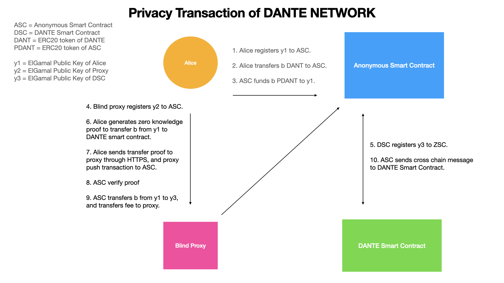
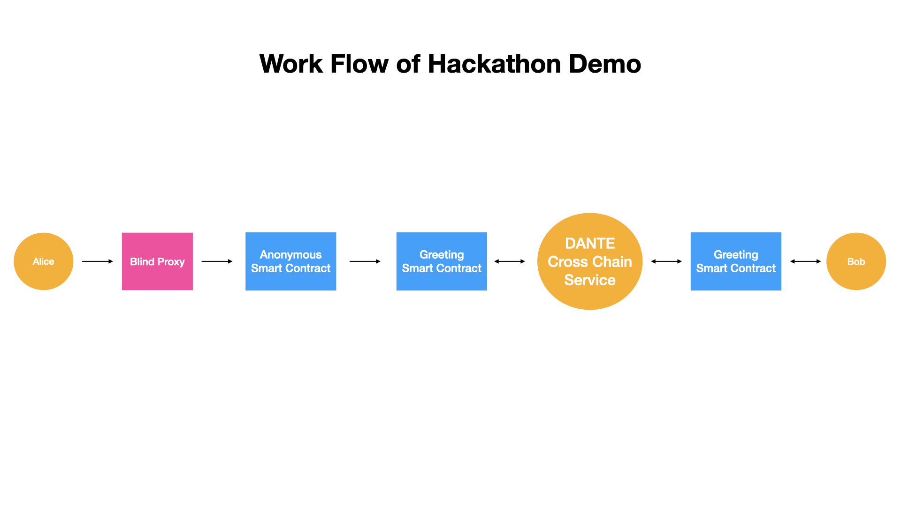

# Privacy transaction solution for Dante Network


## Compile
```
truffle compile
```

## Deploy
```
truffle migrate --network platon --reset --skip-dry-run
```

## Running proxy
```
cd proxy
node index.js
```

## Test
```
node alice.js
node bob.js
```

## Query transaction by explorer

[PlatON Explorer](https://devnetscan.platon.network/contract-detail?address=0xec1bca6cb9025fc45ff66a876fedbd5d26fa0b90)

[NEAR Explorer](https://explorer.testnet.near.org/accounts/9f9350eb575cae7aac7f85a8c62b08d94dcac70a84e3c765464ff87c669fa4e5)


## Work flow of transfer



## Work flow of hackathon demo



## Package alice.js into executable
```
npm i pkg -g
pkg alice.js
```

### output
```
alice-macos
alice-linux
alice-win.exe
```